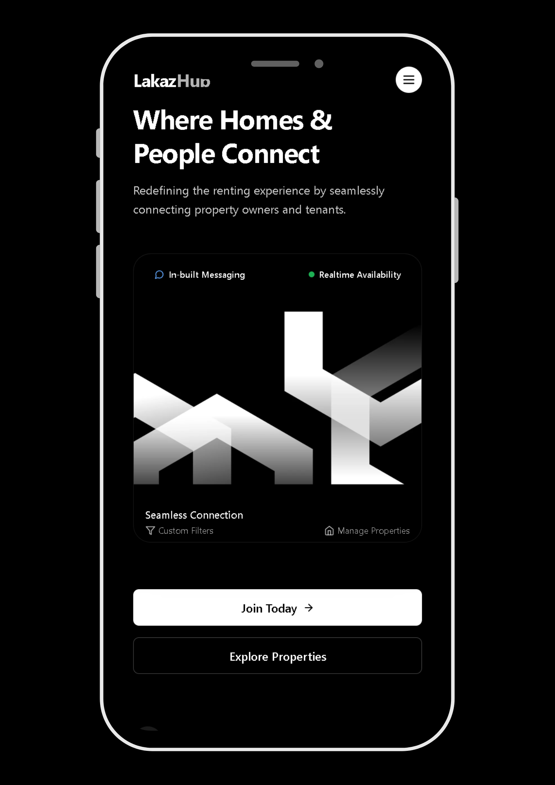
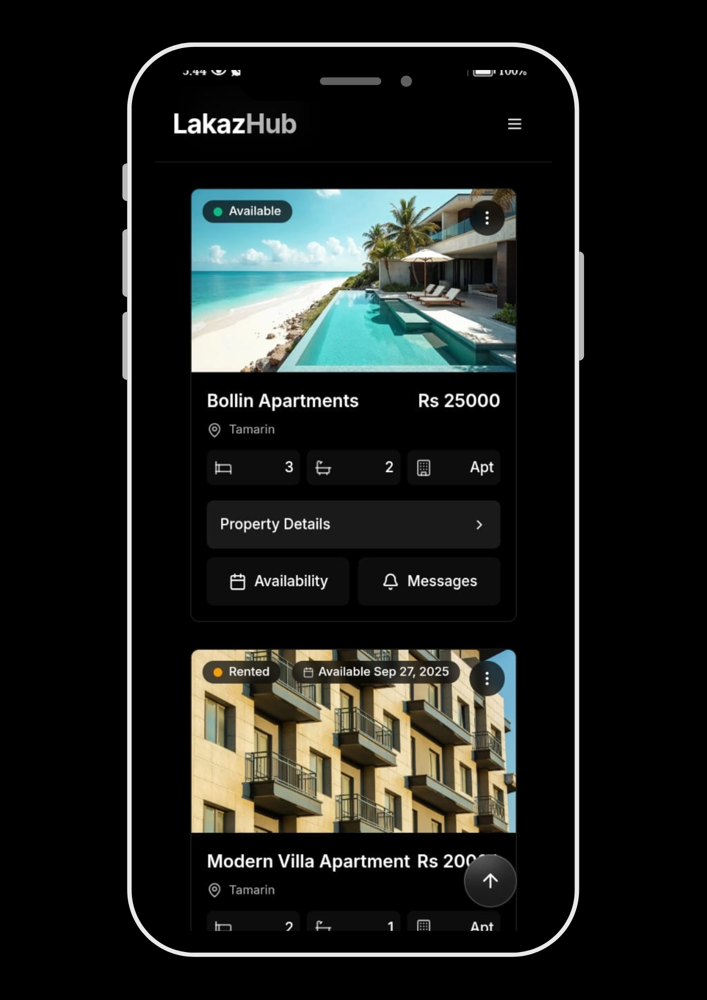
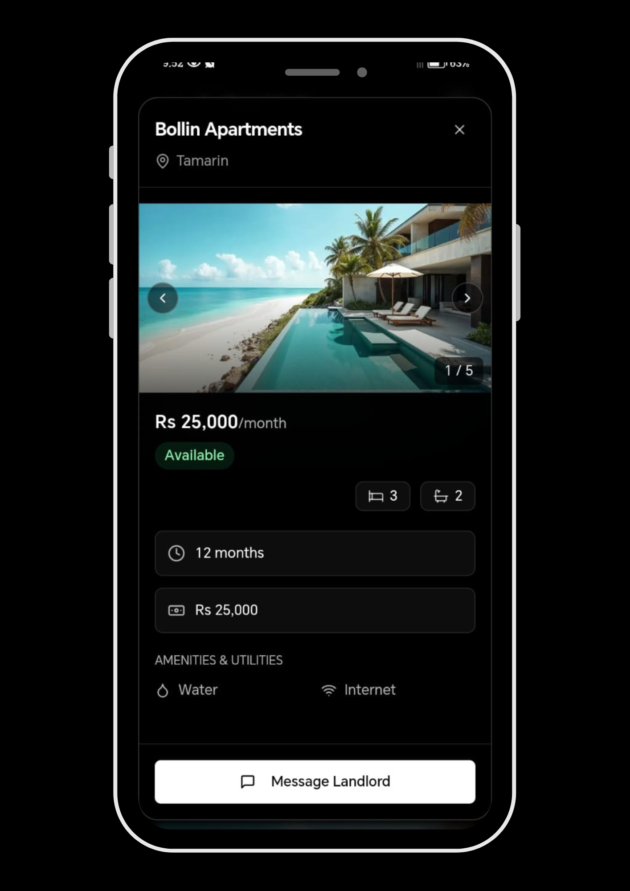
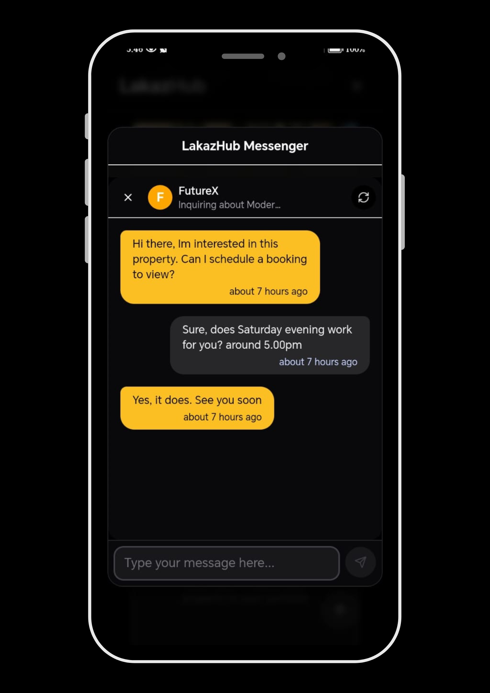

# Lakazhub

**Two-sided long-term rental marketplace for Mauritius**

Lakazhub connects landlords and tenants in a market where no centralised rental platform existed — listings were scattered across Facebook groups, WhatsApp chains, and word of mouth. Landlords manage properties and communicate with prospective tenants entirely within the platform. Tenants search, filter, and message landlords without either party ever sharing personal contact details.


> **Status:** Live pilot paused pending business registration. Platform is fully operational.

---

## Preview

### Homepage



*Landing page — role selection before authentication. User picks landlord or tenant before OAuth flow, which determines role assignment at signup.*

### Property Listings



*Tenant-facing property browser — search by location, price range, and bedroom count. Results filtered client-side from a cached dataset.*

### Property View



*Full property detail — categorised room photos, amenities, utilities breakdown, monthly rent, security deposit, and direct message CTA.*

### In-app Messaging



*Privacy-first conversation interface — landlord and tenant communicate entirely within the platform. No phone numbers or personal contact details exchanged.*

---

## What It Does

Long-term rental in Mauritius has no centralised platform. Landlords post on Facebook, tenants hunt across multiple groups, both parties share phone numbers with strangers before knowing if a property is even a fit.

Lakazhub solves both sides of that problem.

**For landlords:** Create an account, list properties with categorised room photos, set pricing and utilities, and manage availability. All tenant communication happens within the platform — no personal contact details exposed until both parties choose to share them.

**For tenants:** Browse verified listings, filter by location, price range, and bedroom count, view full property details including amenity and utility breakdowns, and message landlords directly. Install the platform as a PWA for a native-app-like experience without an app store.

---

## Architecture

Lakazhub is a Next.js PWA backed entirely by Supabase — database, auth, storage, and real-time subscriptions. There is no separate backend server; all data access goes through the Supabase client SDK and Next.js API routes for server-side operations.

```
┌─────────────────────────────────────────────────────────┐
│                  Next.js Application                     │
│                                                         │
│   ┌─────────────────┐      ┌─────────────────────────┐  │
│   │  Tenant Pages   │      │    Landlord Pages       │  │
│   │  /browse        │      │    /dashboard           │  │
│   │  /property/[id] │      │    /properties/manage   │  │
│   │  /messages      │      │    /messages            │  │
│   └────────┬────────┘      └────────────┬────────────┘  │
│            │                            │               │
│   ┌────────▼────────────────────────────▼────────────┐  │
│   │              Supabase Client SDK                 │  │
│   └──────┬──────────┬──────────┬────────────┬────────┘  │
└──────────┼──────────┼──────────┼────────────┼───────────┘
           │          │          │            │
    ┌──────▼──┐ ┌─────▼──┐ ┌────▼───┐ ┌──────▼──────┐
    │Postgres │ │  Auth  │ │Storage │ │  Realtime   │
    │(data)   │ │(OAuth) │ │(images)│ │(messaging)  │
    └─────────┘ └────────┘ └────────┘ └─────────────┘
```

**Why Supabase over a custom backend:** For a two-sided marketplace at this stage, the operational overhead of a custom backend server is unjustified. Supabase provides row-level Postgres with a REST API, OAuth, file storage, and WebSocket-based real-time subscriptions in one managed platform. The tradeoff is less control over query optimisation and scaling behaviour — an acceptable tradeoff for a product validating market fit.

---

## Data Model

### Core tables

**profiles** — single table for both landlord and tenant users:
```typescript
interface UserProfile {
  id: string;
  full_name: string;
  email_address: string;
  phone_number: string;
  profile_photo: string;
  user_role: 'tenant' | 'landlord';  // single field determines all routing
  created_at: string;
}
```

Role is stored in two places deliberately: in `profiles.user_role` (source of truth) and in Supabase `user_metadata` (fast path for middleware). Middleware prefers the metadata read to avoid a database round-trip on every request. The known risk is drift if one updates without the other — acceptable at current scale, would need a synchronisation trigger at production scale.

**properties** — full listing schema:
```typescript
interface Property {
  id: string;
  name: string;
  location: string;            // from dropdown of 100+ Mauritius locations
  property_type: 'villa' | 'apartment' | 'house' | 'cabin' | 'cottage';
  bedrooms: number;
  bathrooms: number;
  area: number;
  description: string;
  monthly_rent: number;
  security_deposit: number;
  phone_number: string;
  images: string[];            // array of Supabase Storage URLs
  utilities: {                 // JSONB — 6 boolean flags
    water: boolean;
    electricity: boolean;
    internet: boolean;
    gas: boolean;
    trash: boolean;
    cable: boolean;
  };
  amenities: { name: string; icon: string }[];
  rules?: string[];
  available: boolean;
  status: 'active' | 'archived' | 'pending' | 'rented';
  availability?: 'Available' | 'Rented' | 'Coming Soon';
  next_available_date?: string;
  landlord_id: string;         // FK to profiles
}
```

**property_conversations** — three-way scoping:
```typescript
interface Conversation {
  id: string;
  property_id: string;         // which property
  landlord_id: string;         // which landlord
  tenant_id: string;           // which tenant
  last_message_text: string;
  last_message_at: string;
  landlord_unread_count: number;
  tenant_unread_count: number;
  is_archived: boolean;
}
```

One conversation thread per `(property_id, tenant_id, landlord_id)` triple. A tenant can have separate conversations about different properties from the same landlord. Messages are retrieved via a Postgres RPC function (`get_conversation_messages`) with server-side pagination — encapsulating join logic and keeping the client query simple.

---

## Key Features

### Property listing management

Landlords create listings through a three-tab modal form:

**Tab 1 — Basic info:** Name, location (dropdown of 100+ Mauritius locations), property type, bedrooms, bathrooms, area, description, phone number.

**Tab 2 — Photos:** Categorised by room type. Five room categories are required before the form can be submitted — exterior, bedroom, bathroom, kitchen, living room — plus up to 5 additional photos. Validation is enforced in the frontend form:

```typescript
const requiredPhotos = ["exterior", "bedroom", "bathroom", "kitchen", "living"];
const missingPhotos = requiredPhotos.filter(
  type => !formData.images.some(img => img.type === type)
);
// Blocks submission until all 5 categories are present
```

Images upload to Supabase Storage at path `{propertyId}/{roomType}/{timestamp}-{randomId}.ext`, max 10MB per file.

**Tab 3 — Pricing:** Monthly rent, security deposit, utilities checkboxes (6 flags), availability toggle, status.

### Property search and filtering

Tenants filter properties by location, price range (min/max monthly rent), and bedroom count. Filtering is client-side against a locally cached dataset:

```typescript
// Fetch: entire active properties table, ordered by created_at
const { data } = await supabase
  .from('properties')
  .select('*')
  .order('created_at', { ascending: false });

// Filter: client-side in React
function applyFiltersToProperties(properties, filters) {
  let filtered = properties.filter(
    p => p.available === true && p.status === 'active'
  );
  if (filters.minPrice)
    filtered = filtered.filter(p => p.monthly_rent >= parseInt(filters.minPrice));
  if (filters.maxPrice)
    filtered = filtered.filter(p => p.monthly_rent <= parseInt(filters.maxPrice));
  if (filters.bedrooms === '5+')
    filtered = filtered.filter(p => p.bedrooms >= 5);
  else if (filters.bedrooms)
    filtered = filtered.filter(p => p.bedrooms === parseInt(filters.bedrooms));
  if (filters.location)
    filtered = filtered.filter(p =>
      p.location.toLowerCase().includes(filters.location.toLowerCase())
    );
  return filtered;
}
```

Results are cached in `localStorage` for 30 minutes to reduce Supabase reads.

**Known limitation:** Fetching the full properties table and filtering in JavaScript works at the current dataset size but does not scale — at a few thousand listings, query time and payload size would require server-side filtering with indexed Postgres queries, cursor-based pagination, and a proper search layer (Postgres full-text search or a dedicated search service). This is the most significant architectural change the platform would need before scaling.

### Privacy-first messaging

All landlord-tenant communication happens within the platform. Neither party needs to share a phone number or email address to have a full conversation about a property.

Conversations are scoped per `(property, tenant, landlord)` triple. A new conversation is created automatically on first contact. Both parties see the full message history for that property thread.

Real-time updates via Supabase Realtime WebSocket subscriptions — when a new message arrives, the recipient's unread count and conversation preview update live without a page refresh:

```typescript
supabase
  .channel('property_conversations_channel')
  .on('postgres_changes', {
    event: 'UPDATE',
    schema: 'public',
    table: 'property_conversations',
    filter: `landlord_id=eq.${user.id}`,
  }, (payload) => {
    // Update unread count badge and conversation list preview
  })
  .subscribe();
```

The subscription filter (`landlord_id=eq.{user.id}`) ensures each user only receives updates for their own conversations. Access control is enforced at the application layer via Next.js middleware role checks. Row-level security policies were configured via the Supabase dashboard during development and are not currently tracked in code — a known gap for reproducibility that would be addressed before a production relaunch.

### Authentication and role management

Email/password and OAuth (Google, Facebook, Apple) via Supabase Auth with PKCE flow.

Role assignment is handled at the entry point — users select landlord or tenant on the landing page before initiating OAuth. The role is passed as a query parameter through the OAuth flow and written to both `user_metadata` (for fast middleware reads) and `profiles.user_role` (as the database source of truth) at the callback:

```typescript
// Middleware: two-layer role check
if (user.user_metadata?.user_role) {
  userRole = user.user_metadata.user_role;   // fast path — no DB round-trip
} else {
  const { data } = await supabase
    .from('profiles')
    .select('user_role')
    .eq('id', user.id)
    .single();
  userRole = data?.user_role;                // slow path — DB fallback
}

// Role-based routing enforcement
if (userRole === 'tenant' && requiredRole === 'landlord')
  return redirect('/tenant-dashboard');
if (userRole === 'landlord' && requiredRole === 'tenant')
  return redirect('/landlord-dashboard');
```

---

## PWA Implementation

Lakazhub is a real PWA — not just a responsive web app. It includes a web manifest and service worker, making it installable to the home screen on both Android and iOS.

**`public/manifest.json`:**
```json
{
  "name": "LakazHub",
  "display": "standalone",
  "start_url": "/",
  "theme_color": "#000000",
  "icons": [{ "src": "/lakaz-hub.png", "sizes": "192x192", "purpose": "any maskable" }]
}
```

**`public/sw.js`:** Cache-first strategy. Caches core assets (`/`, `/manifest.json`, icons) on service worker install. Falls back to network on cache miss.

An iOS-specific install prompt component handles the "Add to Home Screen" flow for Safari users, where the browser's native install prompt is not available.

**Known gap:** The icon manifest currently has one size (192×192). A production-ready PWA would include at least a 512×512 icon and separate entries for `maskable` and `any` purposes to render correctly across all Android launcher contexts.

---

## Tech Stack

| Layer | Technology |
|---|---|
| Framework | Next.js 15 (App Router) |
| Language | TypeScript |
| Database | Supabase (PostgreSQL) |
| Auth | Supabase Auth — email/password + OAuth (Google, Facebook, Apple) |
| Storage | Supabase Storage (property images) |
| Real-time | Supabase Realtime (WebSocket subscriptions) |
| Hosting | Vercel |
| PWA | Web manifest + service worker (cache-first) |

---

## Project Structure

```
lakazhub/
│
├── app/                          Next.js App Router
│   └── (dashboard)/
│       ├── (landing)/            Public marketing page + OAuth callback
│       ├── landlord-dashboard/   Landlord property management + messaging
│       └── tenant-dashboard/     Tenant property browsing + messaging
│
├── utils/
│   ├── types/                    TypeScript interfaces (Property, Profile, Conversation)
│   └── supabase/                 Supabase client + middleware configuration
│
├── public/
│   ├── manifest.json             PWA manifest
│   └── sw.js                     Service worker (cache-first)
│
└── middleware.ts                  Role-based route protection
```

---

## Local Development

### Prerequisites

- Node.js 18+
- A Supabase project (free tier is sufficient)

### Setup

```bash
git clone https://github.com/MathewM27/lakazhub
cd lakazhub
npm install
cp .env.example .env.local
```

Fill in `.env.local`:
```env
NEXT_PUBLIC_SUPABASE_URL=your_supabase_project_url
NEXT_PUBLIC_SUPABASE_ANON_KEY=your_supabase_anon_key
NEXT_PUBLIC_SITE_URL=http://localhost:3000
```

```bash
npm run dev
```

> **Note:** Database schema was set up via the Supabase dashboard. SQL migration files for the full schema are not currently tracked in this repository — only the `add_phone_number` migration exists in code. A reproducible schema migration setup is a known improvement for a production relaunch.

---

## Validation and Pilot

Lakazhub was deployed and live in Mauritius. During a two-week pilot before pausing for business registration:

- **25+ tenant signups** with active browsing and search activity
- **2 landlords onboarded** with live property listings
- **In-platform messaging active** between landlords and tenants
- No financial transactions — the platform handled discovery and communication only

The platform is fully operational. Business registration requirements paused the rollout; the codebase is ready for relaunch.

---

## What I'd Build Next

The platform is functional at pilot scale. The changes required before handling real production load:

**Server-side filtering and pagination** — replace the full-table fetch with indexed Postgres queries, server-side filter parameters, and cursor-based pagination. Add Postgres full-text search on property name, description, and location.

**RLS policies in code** — migrate all row-level security policies out of the Supabase dashboard and into tracked SQL migration files. Currently the schema is not fully reproducible from the repository alone.

**Real-time availability for tenants** — add a Supabase Realtime subscription on the properties table so tenants see availability changes live rather than from a 30-minute cache.

**Role drift prevention** — add a Postgres trigger or Supabase Edge Function to keep `profiles.user_role` and `user_metadata.user_role` in sync, eliminating the risk of the two sources diverging.

**512×512 PWA icon** — add proper icon sizes and separate maskable/any entries for full Android launcher compatibility.

---

*Built by [Mathews Mwangi](https://mathewsmwangi.com) · [LinkedIn](https://linkedin.com/in/mathews-mwangi-972839219)*
